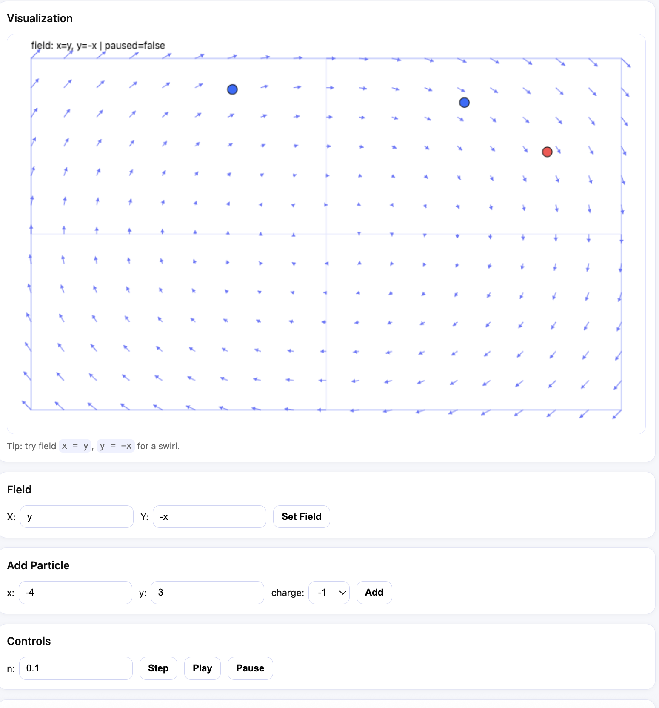

# Vector Simulator



A lightweight 2D vector-field simulator with particle dynamics.

- **Backend**: FastAPI (Python)
- **Frontend**: Plain HTML / CSS / JavaScript (no framework)
- **Math model**: User-defined polynomial vector fields  
- **Dynamics**: Particles move along the vector field with charge-dependent direction

---

## Features

- Define vector fields using polynomial expressions in `x` and `y`
- Add charged particles (`+1` moves with the field, `-1` moves against it)
- Step or play the simulation over time
- Real-time visualization on a canvas
- Safe polynomial parser (no `eval`, no arbitrary code execution)

---

## Project Structure

```
vector_simulator/
├── backend/
│ ├── app/
│ │ ├── main.py # FastAPI app
│ │ └── sim_core/
│ │ ├── engine.py # Simulator logic
│ │ └── polynomial.py # Polynomial evaluator
│ └── .venv/
└── frontend/
  ├── index.html
  ├── styles.css
  └── app.js
```


---

## Backend Setup

```bash
cd backend
python -m venv .venv
source .venv/bin/activate
pip install fastapi uvicorn
```

## Run the API:

python -m uvicorn app.main:app --reload --host 127.0.0.1 --port 5000


Test in browser:

http://127.0.0.1:5000/docs

http://127.0.0.1:5000/api/state

Frontend Setup
cd frontend
npm install
npx serve -l 3001 .


Open:

http://localhost:3001

How to Use
### 1. Set a Vector Field

Examples (polynomial only):

Field X	Field Y	Description
y	-x	Circular swirl
x	y	Outward source
-x	-y	Inward sink
x	-y	Saddle
x^2-y^2	2x	Nonlinear
### 2. Add Particles

Position within bounds [-10, 10]

Charge +1 or -1

### 3. Control Simulation

Step: advance by n × dt

Play / Pause: continuous stepping

Reset: clear simulation

### Math Model

For each particle (x, y):

dx = Fx(x, y)
dy = Fy(x, y)

x += charge × dx × dt
y += charge × dy × dt


Particles leaving bounds are removed.

### Notes

Expressions support: x, y, integers, + -, and ^ (exponent)

Spaces are optional (y-x, 2x+3y-10 both valid)

No trigonometric functions by design (polynomial-only)
